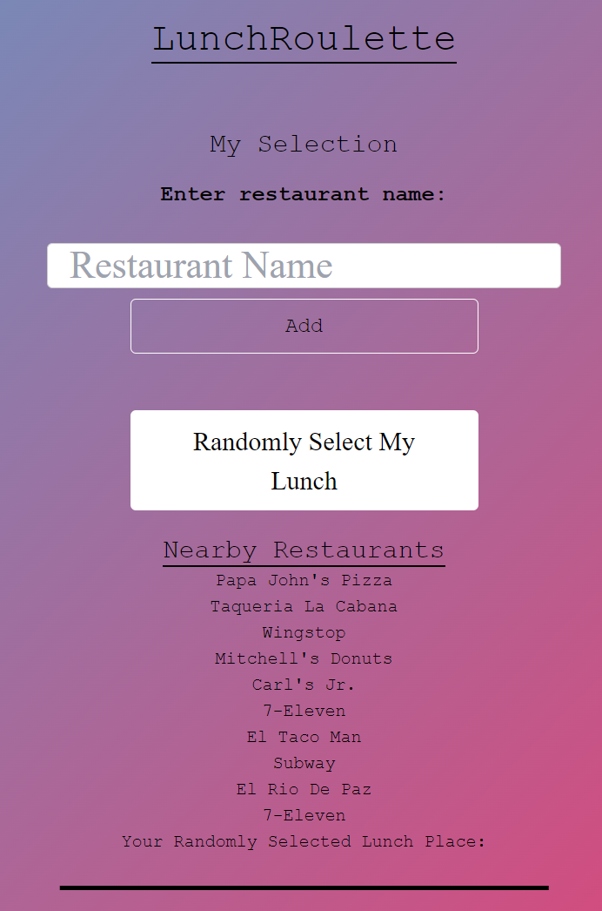

## DESCRIPTION
The Lunch Generator is a simple user-friendly application designed to help you decide what to eat for lunch within your city. Let the Lunch Generator do the work for you! Whether you're in a new city or simply looking to break your routine, our app will provide you with delicious and diverse food options in your area!

## FEATURES
Location-Based Recommendations: The app uses your specified city/state to generate lunch recommendations in your area.
Randomized Selection: Can't decide? Let the app choose for you with a simple click of a button.
Favorites: Share one of your favorite places from your last picked choices

## Usage
Screenshot:

## Link to GitHub Repository
https://github.com/Siennaxstarr/LunchRoulette

## Link to Deployed Application
https://siennaxstarr.github.io/LunchRoulette/

## Credits
Richard Song - https://github.com/song-richard
Sienna Vigil - https://github.com/Siennaxstarr
Chris Purcell - https://github.com/the-real-chrisp